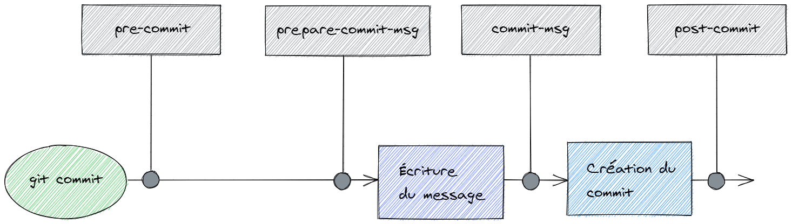
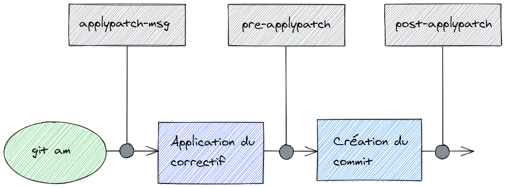

# Mise en Place et Partage des Hooks Git avec Husky [d'après l'article d'Arkerone sur Code heroes](https://www.codeheroes.fr/2021/10/11/git-lutilisation-des-hooks-avec-husky/)

La mise en place des hooks Git et leur partage avec l'ensemble de l'équipe peut parfois être complexe. Cependant, l'utilisation de la librairie Husky simplifie grandement ce processus. 

## Un Hook, C'est Quoi ?

Un hook est un script qui s'exécute automatiquement lorsqu'un événement particulier se produit dans un dépôt Git. Il existe deux types de hooks :
- **Hooks côté client** : S'exécutent sur les machines des utilisateurs, sans être partagés avec les autres membres de l'équipe.
- **Hooks côté serveur** : S'exécutent sur le serveur qui héberge le dépôt Git.

### Hooks Côté Client

Les hooks côté client se divisent en trois catégories :
1. **Hooks concernant les commits** :
    - `pre-commit` : Se déclenche avant la saisie du message de commit.
    - `prepare-commit-msg` : Se déclenche avant le lancement de l'éditeur de message.
    - `commit-msg` : Se déclenche après l'édition du message, mais avant la création du commit.
    - `post-commit` : Se déclenche après la création du commit.
    

2. **Hooks concernant l'application de correctifs** :
    - `applypatch-msg` : Se déclenche avant l'application du correctif.
    - `pre-applypatch` : Se déclenche après l'application du correctif, mais avant la création du commit associé.
    - `post-applypatch` : Se déclenche après l'application du correctif et la création du commit.
    
3. **Hooks concernant d'autres opérations** :
    - `pre-rebase` : Se déclenche avant l'exécution de `git rebase`.
    - `post-checkout` : Se déclenche après `git checkout` ou `git clone`.
    - `post-merge` : Se déclenche après `git merge`.
    - `pre-push` : Se déclenche avant l'exécution de `git push`.

### Hooks Côté Serveur

Les hooks côté serveur s'exécutent uniquement sur le serveur hébergeant le dépôt Git :
- `pre-receive` : Se déclenche lors d'un `git push`, avant la réception des objets et des références.
- `update` : Similaire à `pre-receive`, mais s'exécute pour chaque branche modifiée.
- `post-receive` : Se déclenche après la mise à jour des objets et références.

La liste complète des hooks est disponible sur la [documentation officielle de Git](https://git-scm.com/docs/githooks).


## Utiliser la librairie Husky
- Installation
```sh
npm install husky --save-dev
npx husky install
```
- Cela crée un dossier .husky contenant les hooks. Pour s’assurer que les hooks sont activés après l’installation des paquets :
```sh
// Celle-ci va simplement ajouter un script prepare dans le fichier package.json
npm set-script prepare "husky install"
````
- Ajouter des Hooks avec Husky - Pour créer un hook pre-commit :
```sh
npx husky add .husky/pre-commit "CMD"
```
<details><summary>Exemple d'utilisation - Respecter une Convention d'Écriture des Messages de Commit</summary>

Dans un projet, il est important de maintenir une convention d'écriture cohérente pour les messages de commit. Husky permet d'automatiser cette vérification grâce à un hook `commit-msg`.
- Activez Husky :
```sh
npx husky install
````
- Ajouter un Hook pour Vérifier les Messages de Commit  
- Pour ajouter un hook commit-msg qui vérifiera que vos messages de commit respectent une convention spécifique, utilisez la commande suivante :
```sh
npx husky add .husky/commit-msg 'npx commitlint --edit "$1"'
```
- Configurer Commitlint - Pour utiliser commitlint, vous devez l’installer ainsi qu’une configuration par défaut :
```sh
npm install @commitlint/{config-conventional,cli} --save-dev
```
-Créez ensuite un fichier commitlint.config.js à la racine de votre projet avec le contenu suivant :
```sh
module.exports = { extends: ['@commitlint/config-conventional'] };
```
-Tester le Hook - Maintenant, essayez de faire un commit avec un message qui ne respecte pas la convention (par exemple, sans préfixe de type comme feat, fix, etc.) :
```sh
git add .
git commit -m "Un message incorrect"
```
Vous verrez que le commit est bloqué, et une erreur est affichée pour vous informer que le message ne respecte pas la convention.
- Corriger le Message et Recommencer
```sh
git commit -m "fix: corriger un bug mineur"
```
Le commit passera cette fois-ci, car le message est conforme aux règles définies.
</details>

## Utiliser lint-staged
`lint-staged` est une librairie qui permet d'exécuter des commandes de formatage et de linting uniquement sur les fichiers indexés (staged) lors d'un commit.

- Installez `lint-staged` :
```sh
npm install lint-staged --save-dev
```
- Créer un fichier .lintstagedrc :
	- prettier --write : Formate les fichiers dont l’extension est .js, .html, ou .css.
	- eslint --fix : Corrige les erreurs ESLint dans les fichiers .js.
```sh
{
  "*.(js|html|css)": [
    "prettier --write"
  ],
  "*.js": [
    "eslint --fix"
  ]
}
```
- Pour exécuter lint-staged avant chaque commit, ajoutez un hook pre-commit avec Husky :
```sh
npx husky add .husky/pre-commit "npx lint-staged"
```
- Vérifier les Tests Avant un git push  
Il est également recommandé de vérifier que les tests passent avant d’envoyer du code sur le dépôt distant. Pour ce faire, ajoutez un hook pre-push :
```sh
npx husky add .husky/pre-push "npm run test"
````
Si les tests échouent, le git push sera bloqué, empêchant ainsi l’envoi de code défectueux sur le dépôt.